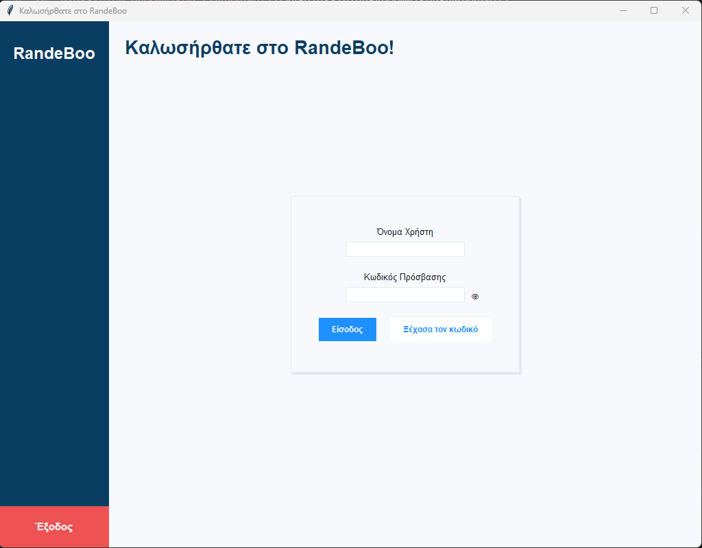
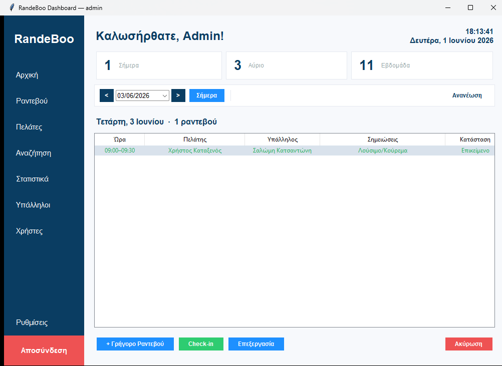
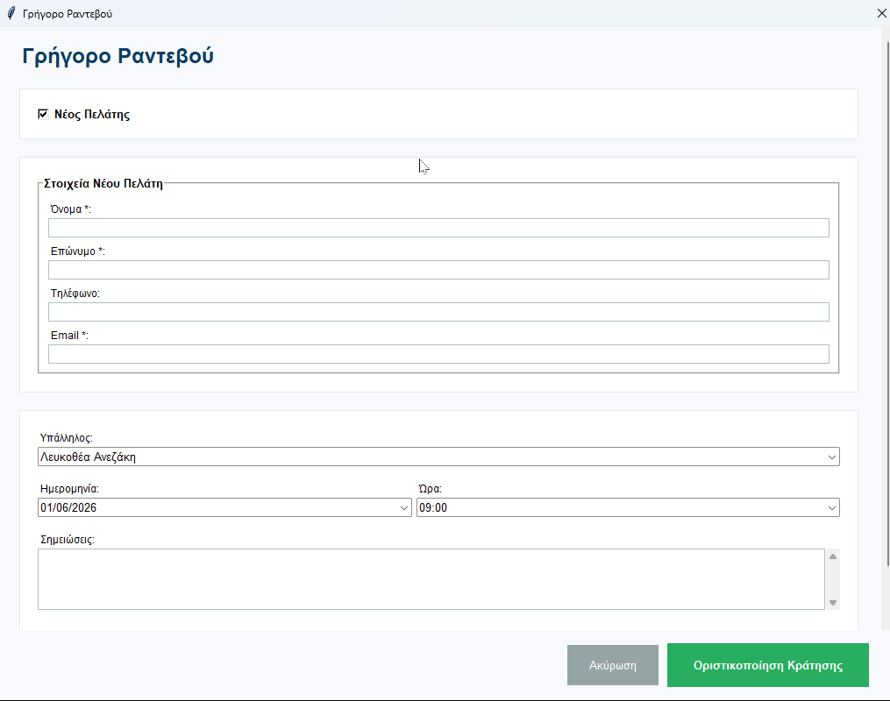
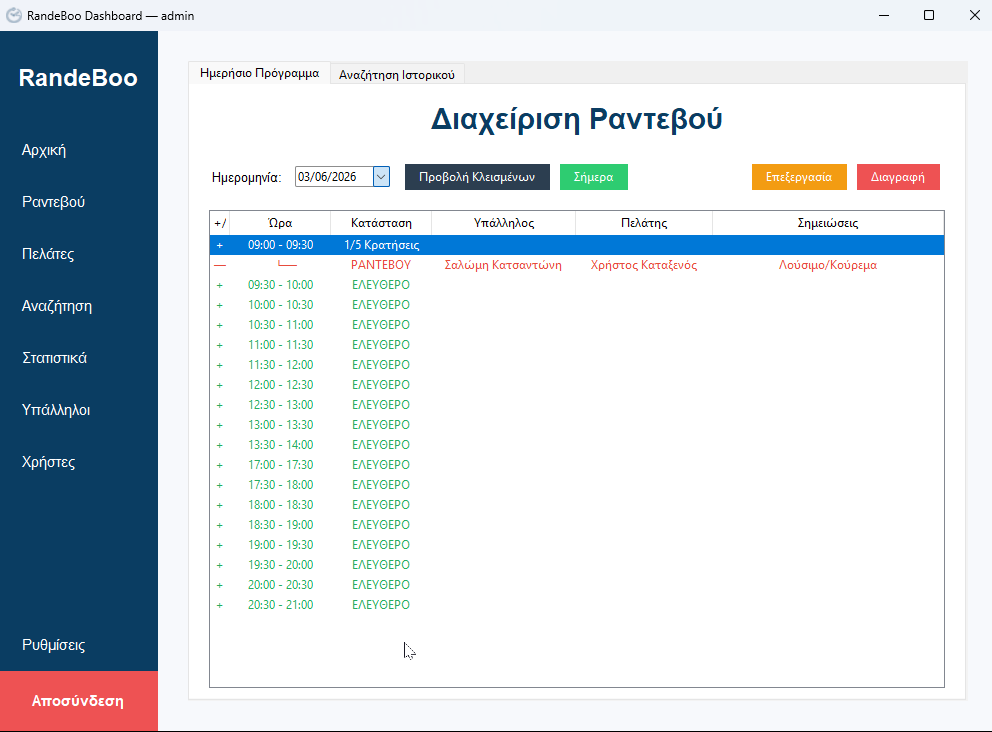
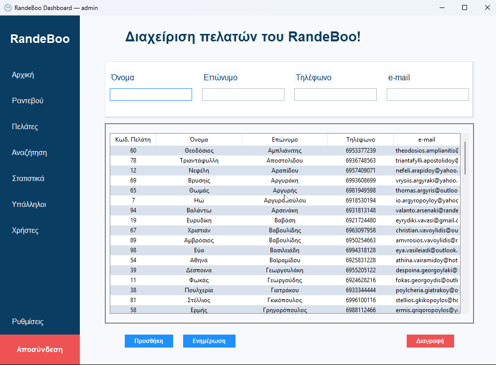
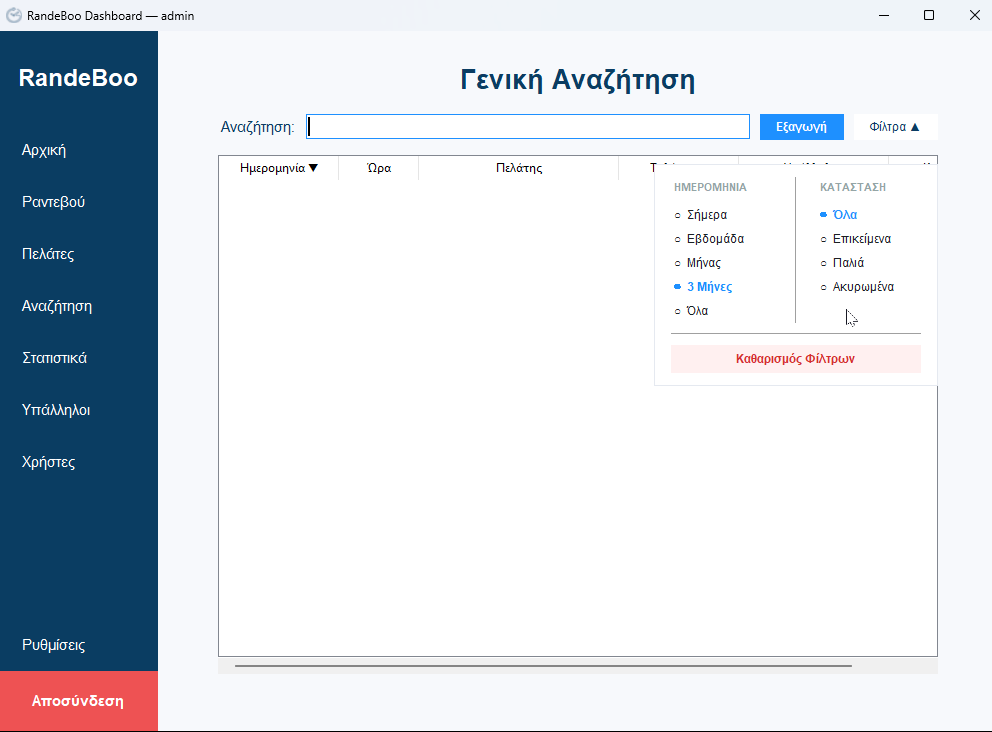
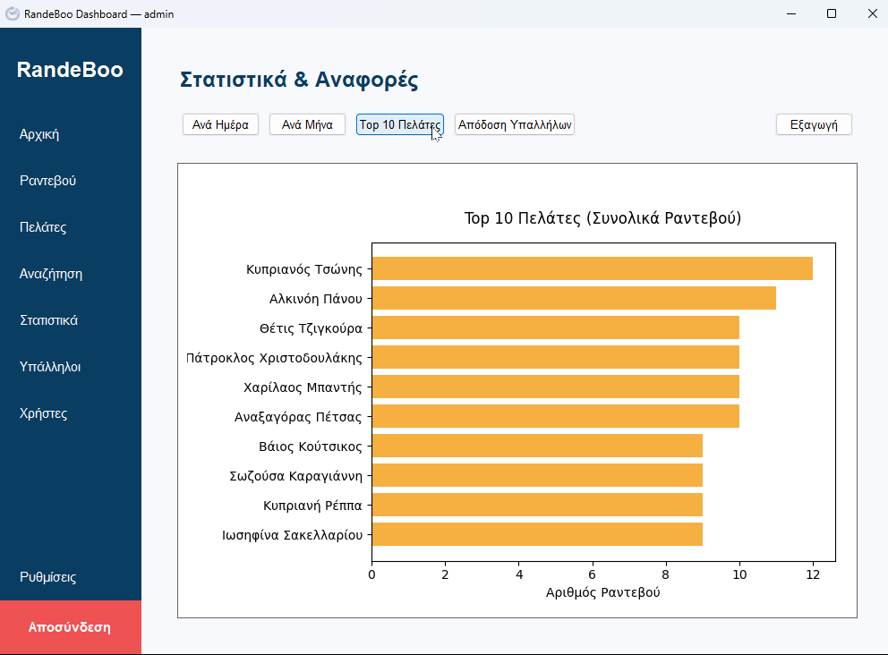
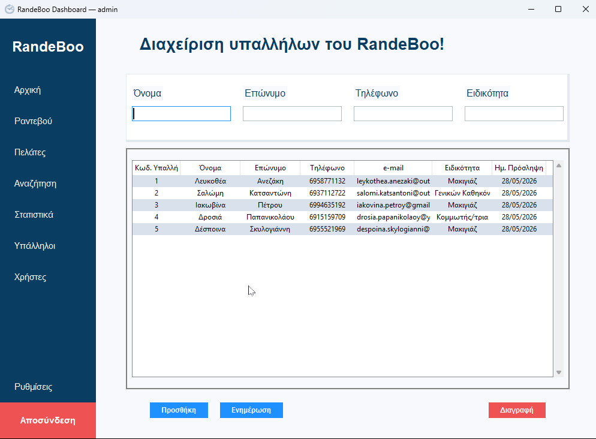
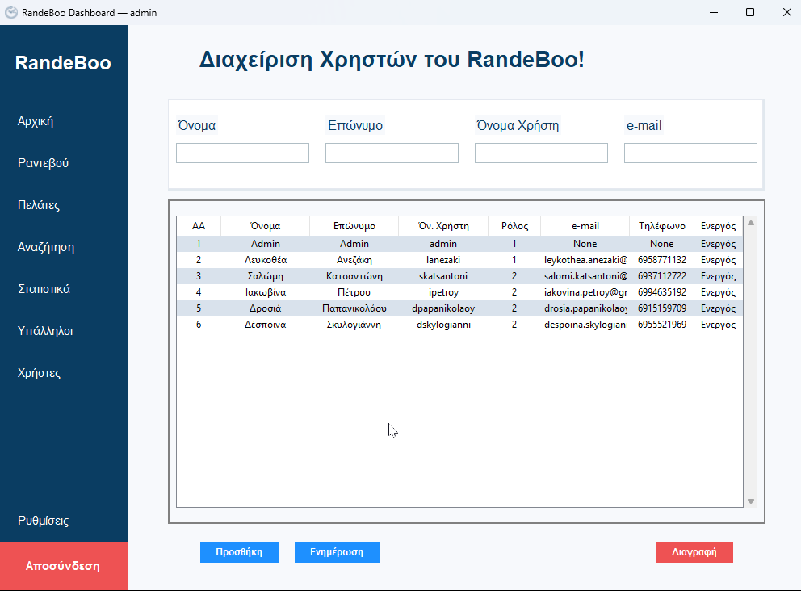
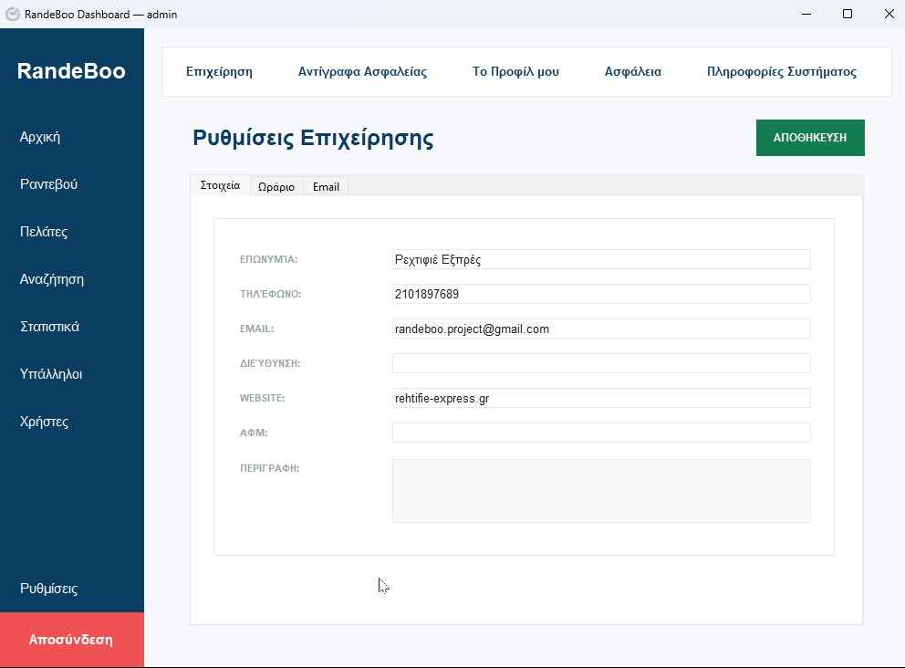

# RandeBoo — Οδηγός Χρήσης Εφαρμογής

Καλώς ορίσατε στον επίσημο οδηγό χρήσης του **RandeBoo**, της ολοκληρωμένης desktop εφαρμογής διαχείρισης ραντεβού για την επιχείρησή σας.

Αυτός ο οδηγός θα σας βοηθήσει να κατανοήσετε όλες τις λειτουργίες του συστήματος, από την πρώτη είσοδο μέχρι τη λήψη αντιγράφων ασφαλείας και την εξαγωγή στατιστικών στοιχείων.

---

## Πίνακας Περιεχομένων
1. [1. Εκκίνηση & Σύνδεση στην Εφαρμογή](#1-εκκίνηση--σύνδεση-στην-εφαρμογή)
2. [2. Κεντρικό Dashboard & Πλοήγηση](#2-κεντρικό-dashboard--πλοήγηση)
3. [3. Γρήγορη Κράτηση Ραντεβού (Quick Booking)](#3-γρήγορη-κράτηση-ραντεβού-quick-booking)
4. [4. Ημερολόγιο & Διαχείριση Ραντεβού](#4-ημερολόγιο--διαχείριση-ραντεβού)
5. [5. Διαχείριση Πελατών](#5-διαχείριση-πελατών)
6. [6. Αναζήτηση & Φιλτράρισμα Ραντεβού](#6-αναζήτηση--φιλτράρισμα-ραντεβού)
7. [7. Στατιστικά & Αναφορές (Analytics)](#7-στατιστικά--αναφορές-analytics)
8. [8. Διαχείριση Προσωπικού (Υπάλληλοι)](#8-διαχείριση-προσωπικού-υπάλληλοι)
9. [9. Διαχείριση Χρηστών (Admin Panel)](#9-διαχείριση-χρηστών-admin-panel)
10. [10. Ρυθμίσεις & Αντίγραφα Ασφαλείας (Backup/Restore)](#10-ρυθμίσεις--αντίγραφα-ασφαλείας-backuprestore)

---

## 1. Εκκίνηση & Σύνδεση στην Εφαρμογή

Όταν ανοίγετε την εφαρμογή RandeBoo, η πρώτη οθόνη που συναντάτε είναι η οθόνη σύνδεσης (Login).

*Εικόνα 1: Φόρμα εισόδου χρήστη.*

### Βήματα Σύνδεσης:
1. Εισάγετε το **Όνομα Χρήστη (Username)** και τον **Κωδικό Πρόσβασης (Password)**.
2. Πατήστε το κουμπί **"Σύνδεση"**.
3. Εάν είστε Διαχειριστής (Admin), θα έχετε πρόσβαση σε όλες τις λειτουργίες. Εάν είστε απλός χρήστης (User), ορισμένες επιλογές ρυθμίσεων και διαχείρισης χρηστών ενδέχεται να είναι απενεργοποιημένες.

> [!NOTE]
> Σε περίπτωση που η βάση δεδομένων έχει κάποιο πρόβλημα κατά την εκκίνηση, η εφαρμογή θα ξεκινήσει αυτόματα σε **Safe Mode**, επιτρέποντάς σας να κάνετε επαναφορά από κάποιο πρόσφατο backup.

[↑ Πίσω στα Περιεχόμενα](#πίνακας-περιεχομένων)

---

## 2. Κεντρικό Dashboard & Πλοήγηση

Μετά την επιτυχή σύνδεση, μεταφέρεστε στο κεντρικό παράθυρο της εφαρμογής.

*Εικόνα 2: Η αρχική οθόνη πλοήγησης και η κεντρική περιοχή προβολής.*

### Στοιχεία της Οθόνης:
*   **Πλευρική Μπάρα (Sidebar - Αριστερά):** Περιλαμβάνει κουμπιά πλοήγησης για τη γρήγορη μετάβαση σε όλες τις ενότητες (Ημερολόγιο, Πελάτες, Προσωπικό, Αναζήτηση, Στατιστικά, Ρυθμίσεις).
*   **Κεντρικό Πάνελ (Δεξιά):** Δυναμικός χώρος όπου φορτώνεται η επιλεγμένη λειτουργία χωρίς να ανοίγουν νέα κουραστικά παράθυρα (Single Page Application layout).
*   **Πληροφορίες Χρήστη (Κάτω Αριστερά):** Εμφανίζει το όνομα του συνδεδεμένου χρήστη και το ρόλο του στο σύστημα, καθώς και ένα ρολόι πραγματικού χρόνου.

[↑ Πίσω στα Περιεχόμενα](#πίνακας-περιεχομένων)

---

## 3. Γρήγορη Κράτηση Ραντεβού (Quick Booking)

Για τις ώρες αιχμής, η εφαρμογή προσφέρει το παράθυρο **Γρήγορης Κράτησης**, το οποίο παρακάμπτει τη διαδικασία πλοήγησης στο ημερολόγιο.

*Εικόνα 3: Αναδυόμενη φόρμα για ταχύτατη καταχώρηση ραντεβού.*

### Χρήση:
*   Ανοίγει με ένα κλικ από την κορυφή του Dashboard ή με συντόμευση.
*   Επιτρέπεται η γρήγορη επιλογή Πελάτη, Υπηρεσίας, Υπαλλήλου και Ώρας σε μία ενιαία φόρμα.
*   Το σύστημα ελέγχει αυτόματα τη διαθεσιμότητα και δεσμεύει το slot άμεσα.

> [!NOTE]
> Η λειτουργία Quick Booking είναι προσβάσιμη απευθείας από την Αρχική Οθόνη (Dashboard) για μέγιστη ταχύτητα κατά τις ώρες αιχμής.

[↑ Πίσω στα Περιεχόμενα](#πίνακας-περιεχομένων)

---

## 4. Ημερολόγιο & Διαχείριση Ραντεβού

Αυτή είναι η καρδιά της εφαρμογής. Σας επιτρέπει να βλέπετε και να προγραμματίζετε ραντεβού ανά ημέρα και ανά υπάλληλο.

*Εικόνα 4: Ημερήσια προβολή ραντεβού με διαθέσιμες χρονοθυρίδες (slots).*

### Πώς να κλείσετε ένα ραντεβού:
1. Επιλέξτε την επιθυμητή **Ημερομηνία** από τον ημερολογιακό επιλογέα.
2. Επιλέξτε τον **Υπάλληλο** από τη λίστα.
3. Το σύστημα θα εμφανίσει τις διαθέσιμες χρονοθυρίδες (π.χ. 09:00, 09:30, 10:00).
4. Κάντε διπλό κλικ σε μια ελεύθερη χρονοθυρίδα ή πατήστε **"Νέο Ραντεβού"**.
5. Επιλέξτε τον πελάτη, την υπηρεσία και πατήστε αποθήκευση.

[↑ Πίσω στα Περιεχόμενα](#πίνακας-περιεχομένων)

---

## 5. Διαχείριση Πελατών

Η καρτέλα αυτή σας επιτρέπει να διαχειρίζεστε τη λίστα των πελατών της επιχείρησής σας.

*Εικόνα 5: Λίστα πελατών με δυνατότητα αναζήτησης και επεξεργασίας.*

### Λειτουργίες:
*   **Αναζήτηση Πελάτη:** Πληκτρολογήστε στο πεδίο αναζήτησης για να φιλτράρετε άμεσα τους πελάτες με βάση το Όνομα, το Επώνυμο ή το Τηλέφωνο.
*   **Προσθήκη Νέου Πελάτη:** Πατήστε το κουμπί **"Προσθήκη"** και συμπληρώστε τα στοιχεία (Όνομα, Επώνυμο, Τηλέφωνο, Email, Σημειώσεις).
*   **Επεξεργασία:** Επιλέξτε έναν πελάτη από τη λίστα και πατήστε **"Επεξεργασία"** για να τροποποιήσετε τα στοιχεία του.
*   **Διαγραφή:** Επιλέξτε έναν πελάτη και πατήστε **"Διαγραφή"**.

> [!WARNING]
> Η διαγραφή ενός πελάτη θα διαγράψει αυτόματα και όλα τα προγραμματισμένα ραντεβού του από το σύστημα (Cascade Delete).

[↑ Πίσω στα Περιεχόμενα](#πίνακας-περιεχομένων)

---

## 6. Αναζήτηση & Φιλτράρισμα Ραντεβού

Αν θέλετε να βρείτε ένα συγκεκριμένο ραντεβού στο παρελθόν ή στο μέλλον, χρησιμοποιήστε την Advanced Search οθόνη.

*Εικόνα 6: Οθόνη αναζήστησης με πολλαπλά κριτήρια.*

### Φίλτρα Αναζήτησης:
*   Όνομα/Επώνυμο Πελάτη
*   Υπάλληλος
*   Εύρος Ημερομηνιών (Από - Έως)
*   Κατάσταση Ραντεβού (Ολοκληρωμένο, Προγραμματισμένο, Ακυρωμένο)

> [!TIP]
> Από αυτή την οθόνη μπορείτε να επιλέξετε τα αποτελέσματα και να κάνετε **Εξαγωγή σε Excel (.xlsx) ή PDF** με το πάτημα ενός κουμπιού.

[↑ Πίσω στα Περιεχόμενα](#πίνακας-περιεχομένων)

---

## 7. Στατιστικά & Αναφορές (Analytics)

Δείτε την πορεία της επιχείρησής σας μέσα από δυναμικά και διαδραστικά γραφήματα.

*Εικόνα 7: Αναλύσεις εσόδων, δημοφιλών υπηρεσιών και απόδοσης προσωπικού.*

### Διαθέσιμα Γραφήματα (Matplotlib):
1.  **Ημερήσια Έσοδα (Bar Chart):** Τα έσοδα των τελευταίων ημερών.
2.  **Μηνιαία Τάση (Line Chart):** Η πορεία των κρατήσεων ανά μήνα.
3.  **Κορυφαίοι Πελάτες (Pie/Bar Chart):** Οι πελάτες με τις περισσότερες επισκέψεις.
4.  **Απόδοση Υπαλλήλων:** Ποσοστό κρατήσεων ανά μέλος της ομάδας.

[↑ Πίσω στα Περιεχόμενα](#πίνακας-περιεχομένων)

---

## 8. Διαχείριση Προσωπικού (Υπάλληλοι)

Εδώ μπορείτε να διαχειριστείτε τους υπαλλήλους της επιχείρησής σας και να ορίσετε τις υπηρεσίες που παρέχει ο καθένας.

*Εικόνα 8: Οθόνη διαχείρισης προσωπικού.*

### Λειτουργίες:
*   **Καταχώρηση Υπαλλήλου:** Προσθήκη νέου μέλους με στοιχεία επικοινωνίας και ειδικότητα.
*   **Ανάθεση Υπηρεσιών:** Επιλογή των υπηρεσιών τις οποίες μπορεί να εκτελέσει ο συγκεκριμένος υπάλληλος.
*   **Διαχείριση Ωραρίου:** Σύνδεση με το εβδομαδιαίο πρόγραμμα εργασίας του κάθε υπαλλήλου για τον σωστό υπολογισμό των διαθέσιμων ραντεβού.

[↑ Πίσω στα Περιεχόμενα](#πίνακας-περιεχομένων)

---

## 9. Διαχείριση Χρηστών (Admin Panel)

Αυτή η καρτέλα είναι προσβάσιμη **μόνο στους Διαχειριστές (Admins)** και επιτρέπει τον πλήρη έλεγχο των λογαριασμών που έχουν πρόσβαση στο σύστημα.

*Εικόνα 9: Λίστα χρηστών της εφαρμογής με φίλτρα αναζήτησης.*

### Λειτουργίες & Χρήση:
*   **Αναζήτηση σε Πραγματικό Χρόνο (Live Search):** Πληκτρολογήστε στα πεδία Όνομα, Επώνυμο, Όνομα Χρήστη ή Email για να φιλτράρετε αυτόματα τη λίστα.
*   **Προσθήκη Νέου Χρήστη:** Πατήστε το κουμπί **"Προσθήκη"** για να ανοίξει η φόρμα καταχώρησης.
    *   Εισάγετε τα βασικά στοιχεία, το επιθυμητό Username και έναν ασφαλή Κωδικό (τουλάχιστον 6 χαρακτήρων).
    *   Ορίστε τον **Ρόλο** (1 για Διαχειριστή/Admin, 2 για απλό Χρήστη/User).
    *   Επιλέξτε αν ο χρήστης θα είναι άμεσα ενεργοποιημένος ή όχι.
*   **Ενημέρωση Χρήστη:** Επιλέξτε έναν χρήστη και πατήστε **"Ενημέρωση"** (ή κάντε διπλό κλικ πάνω του) για να αλλάξετε τα στοιχεία του, τον ρόλο του, ή για να αλλάξετε τον κωδικό πρόσβασής του.
*   **Διαγραφή Χρήστη:** Επιλέξτε τον χρήστη και πατήστε **"Διαγραφή"** για να αφαιρεθεί οριστικά ο λογαριασμός του από το σύστημα.

[↑ Πίσω στα Περιεχόμενα](#πίνακας-περιεχομένων)

---

## 10. Ρυθμίσεις & Αντίγραφα Ασφαλείας (Backup/Restore)

Εδώ διαμορφώνετε τις παραμέτρους της εφαρμογής και προστατεύετε τα δεδομένα σας.

*Εικόνα 10: Πάνελ ρυθμίσεων και διαχείρισης βάσης δεδομένων.*

### Ενότητες Ρυθμίσεων:
*   **Στοιχεία Επιχείρησης:** Όνομα, Διεύθυνση, Τηλέφωνο και Email (χρησιμοποιείται για τις αυτόματες ειδοποιήσεις).
*   **Ρυθμίσεις Ωραρίου & Αργιών:** Καθορισμός εργάσιμων ωρών, εβδομαδιαίων ρεπό και επίσημων αργιών (με αυτόματη υποστήριξη ελληνικών αργιών).
*   **Αντίγραφα Ασφαλείας (Backup):** 
    *   Πατήστε **"Δημιουργία Backup"** για να αποθηκεύσετε ένα χειροκίνητο αντίγραφο της βάσης δεδομένων.
    *   Πατήστε **"Επαναφορά (Restore)"** για να επαναφέρετε τα δεδομένα από κάποιο παλαιότερο αρχείο σε περίπτωση σφάλματος.

[↑ Πίσω στα Περιεχόμενα](#πίνακας-περιεχομένων)

---

*Συγχαρητήρια! Τώρα γνωρίζετε πώς να χρησιμοποιείτε πλήρως το RandeBoo.*
